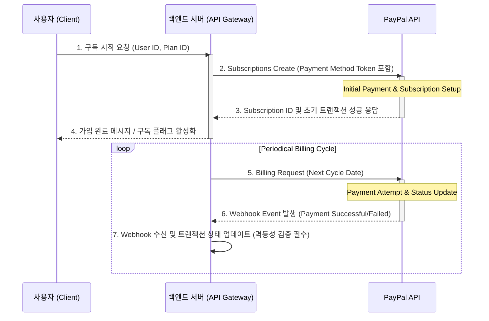

# PayPal 통합 명세

## API 선택 (최종)
- **Subscription Management:** Subscriptions API (메인)를 활용하여 사용자 구독 상태 관리 및 주기적 청구 처리를 담당합니다. 재결제(Renewal) 로직은 이 API가 핵심입니다.
- **Single Transaction/Verification:** REST API 흐름도를 병행하여, 초기 가입 시 단발성 결제 검증이나 웹훅 이벤트 수신 확인 등 간헐적인 트랜잭션 처리에 사용합니다.

## Sandbox → Production 전환 체크리스트 5개
1. **Webhook Endpoint 인증:** 실제 운영 환경에서 웹훅 시그니처(Signature)를 통한 서버 레벨의 유효성 검증을 의무화합니다. (가장 중요)
2. **IP 기반 Rate Limiting 적용:** 게이트웨이 호출 직전에 IP/User ID 단위의 요청 횟수 제한 로직을 추가하여 DoS 및 무차별 대입 공격 방어합니다.
3. **환불 프로세스 자동화 검증:** 환불 발생 시, 단순히 플래그만 변경하는 것이 아니라 DB 내 `Refund_Source` 필드와 `Refund_Date`를 기록하고, 이 정보를 기반으로 크론 작업(Cron Job)을 통해 시스템이 재현 가능한지 테스트합니다.
4. **에러 핸들링 분기:** PayPal API 호출 실패 시, 단순한 클라이언트 에러 메시지 대신 사용자에게 '재시도 권장' 및 서버 로그에 상세 오류 코드를 기록하는 백업 로직을 구현합니다.
5. **승인(Approval) Flow 테스트:** 구독 결제 외의 단발성 서비스 이용 시 필요한 승인 플로우(예: Pre-Auth/Capture)가 정상적으로 작동하는지 모의 거래로 검증합니다.

## Webhook 이벤트 명세
| Event Type | 발생 상황 | 백엔드 처리 로직 | 멱등성 처리 (Idempotency) |
| :--- | :--- | :--- | :--- |
| `payment.succeeded` | 결제 성공 및 구독 활성화 | DB 트랜잭션 상태를 `ACTIVE`로 변경하고, 사용자 권한 플래그를 **활성화**합니다. | 수신된 Webhook ID와 내부 트랜잭션 레코드를 비교하여 이미 처리된 경우 무시(Skip)합니다. |